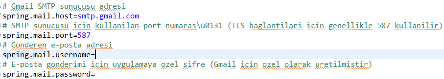
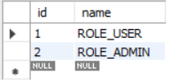

# Otopark Yönetimi

## Kullanılan Teknolojiler
- **Java Versiyonu:** `17.0.7`
- **Spring Boot Versiyonu:** `3.3.2`
- **MySQL Versiyonu:** `8.0.40`

Bu proje yukarıdaki sürümlerle yapılandırılmıştır. Diğer sürümlerle uyumluluk hakkında aşağıdaki önerilere başvurabilirsiniz.

## Uyumluluk Rehberi

### Java
- **Minimum Gerekli Versiyon:** `Java 17.0.0`
- **Önerilen Versiyon:** `Java 17.0.7` ve üzeri
- **Tavsiye Edilmeyenler:** `Java 16` veya daha düşük sürümler Spring Boot 3.x ile uyumlu olmayabilir. Java 18 ve daha yeni sürümler desteklenmekle birlikte ek yapılandırma değişiklikleri gerekebilir.

### Spring Boot
- **Minimum Gerekli Versiyon:** `Spring Boot 3.3.0`
- **Önerilen Versiyon:** `Spring Boot 3.3.2` ve üzeri
- **Uyumlu Versiyonlar:** `Spring Boot 3.3.x` serisi, proje yapısıyla tamamen uyumludur ve Spring Boot Security ile sorunsuz çalışır.
- **Tavsiye Edilmeyenler:** `3.2.x` ve daha düşük sürümler, bazı güvenlik özelliklerini desteklemeyebilir ve mevcut proje yapısıyla uyumsuz olabilir.

### MySQL
- **Minimum Gerekli Versiyon:** `MySQL 8.0.20`
- **Önerilen Versiyon:** `MySQL 8.0.40` ve üzeri
- **Uyumlu Versiyonlar:** `MySQL 8.0.20` ile `8.1.x` arasındaki sürümler, proje ile uyumlu olup güncel güvenlik standartlarını karşılamaktadır.
- **Tavsiye Edilmeyenler:** `MySQL 5.x` ve daha eski sürümler, projede kullanılan bazı SQL sorguları ve veri tipleriyle sorun oluşturabilir. `MySQL 8.2.x` ve üzeri, burada belirtilmeyen ek yapılandırma ayarlarını gerektirebilir.

## E-posta Konfigürasyonu

Bu proje, e-posta bildirimleri için Gmail’in SMTP sunucusunu kullanmaktadır. Aşağıdaki ayarları `application.properties` dosyasına ekleyerek e-posta gönderimi için gerekli konfigürasyonu yapabilirsiniz:



- **spring.mail.host**: `smtp.gmail.com`
- **spring.mail.port**: `587`
- **spring.mail.username**: Email adresiniz (e.g., `your-email@gmail.com`)
- **spring.mail.password**: Google hesabınızın güvenlik ayarları üzerinden oluşturulan uygulamaya özel şifre.

> **Not**: Gmail için uygulamaya özel bir parola ayarlama hakkında ayrıntılı talimatlar için [bu videoya](https://www.youtube.com/watch?v=3vINS4tzjIw&list=LL&index=2) başvurabilirsiniz. Bu video, iki faktörlü kimlik doğrulamayı etkinleştirme ve uygulamaya özel bir parola oluşturma konusunda adım adım rehberlik sağlar.

#### Günlük E-posta Gönderim Limitleri
- **Kişisel Gmail Hesapları:** Gmail, günlük **500 e-posta** gönderim limiti uygulamaktadır. Bu limit, yüksek hacimli e-posta gönderen uygulamaları etkileyebilir.
- **Kurumsal Gmail Hesapları:** G Suite (Google Workspace) hesapları genellikle daha yüksek bir günlük e-posta gönderim limitine sahiptir ve abonelik seviyesine bağlı olarak günlük **2.000 e-posta** göndermeye izin verebilir.

> **Hatırlatma:** Uygulamaya özel şifre oluşturmak için Google hesabınızda iki faktörlü kimlik doğrulamayı etkinleştirmeniz gereklidir.

## Veritabanı Konfigürasyonu

Projeyi kurduktan sonra, veritabanınızdaki `roles` tablosunu aşağıdaki girdilerle yapılandırmanız gerekmektedir:



- `ROLE_USER`
- `ROLE_ADMIN`

Bu rolleri eklemek için aşağıdaki SQL sorgusunu çalıştırabilirsiniz:

```sql
INSERT INTO roles (id, name) VALUES
(1, 'ROLE_USER'),
(2, 'ROLE_ADMIN');
```

Bu kurulum, uygulama içerisindeki rol tabanlı erişim kontrolü için gereklidir. Rollerin eksik olması durumunda bazı işlevler beklenildiği gibi çalışmayabilir.


